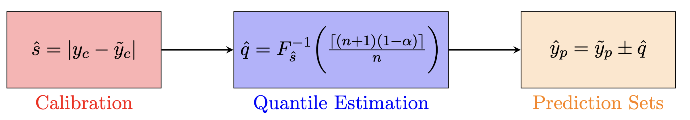
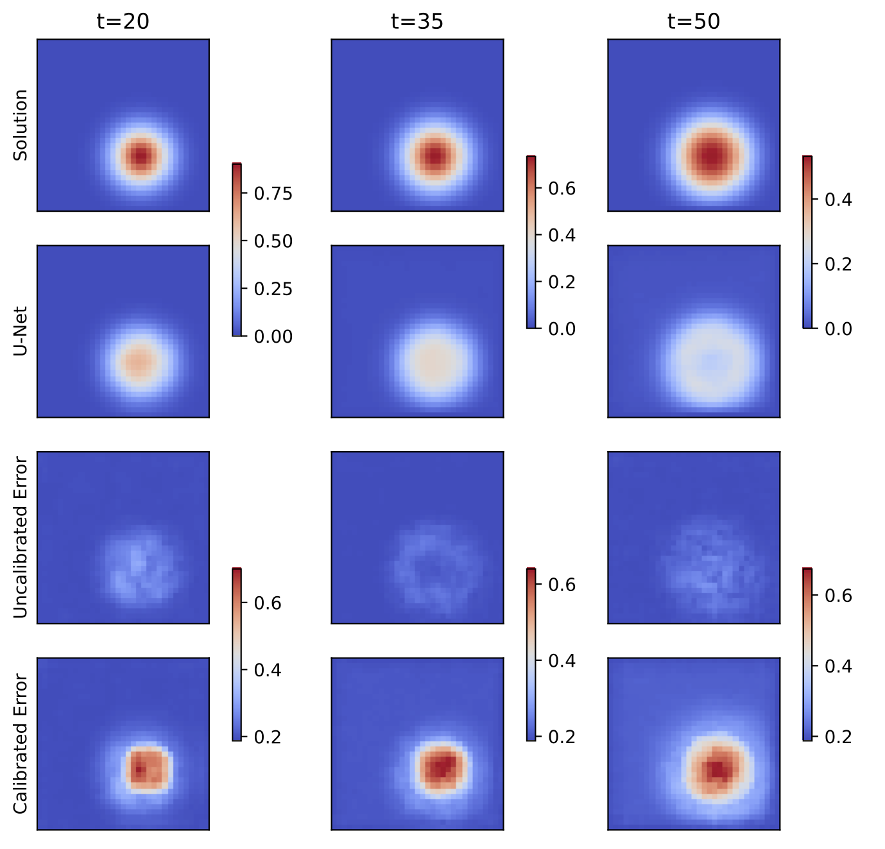
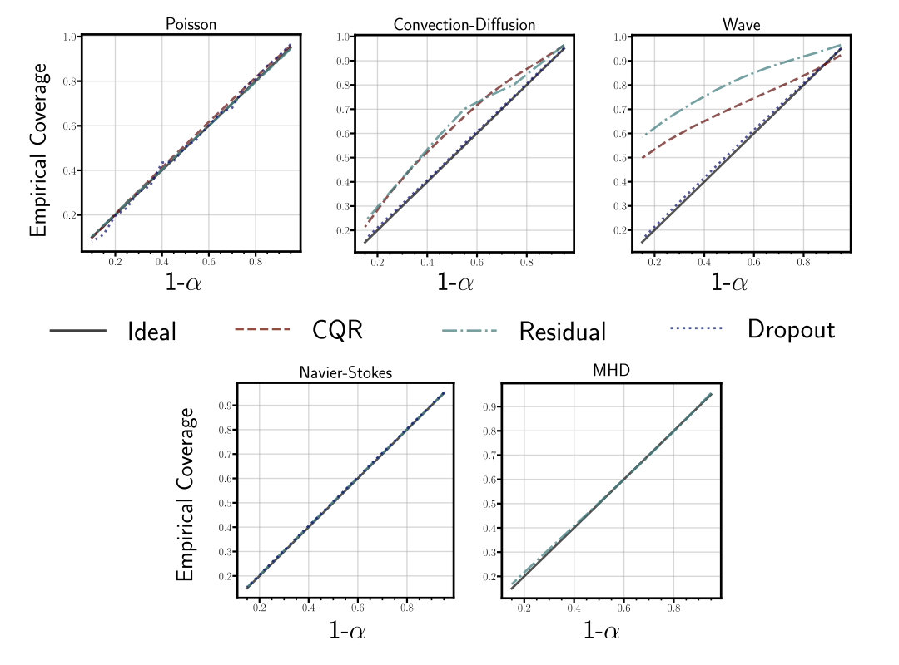
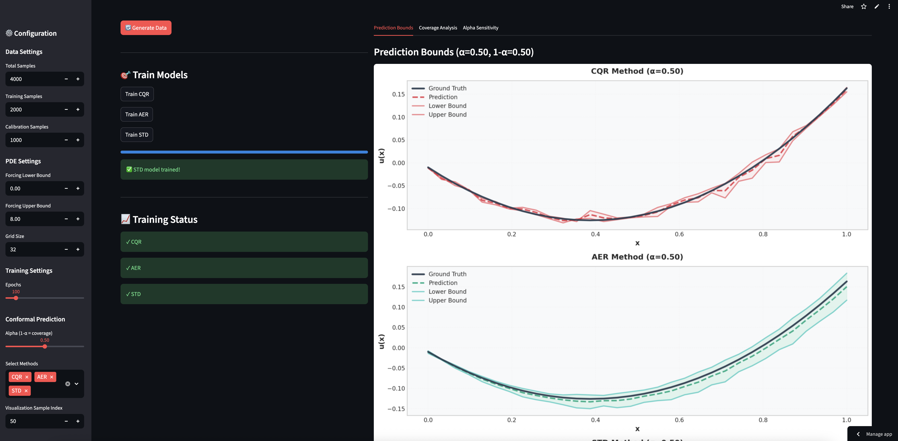
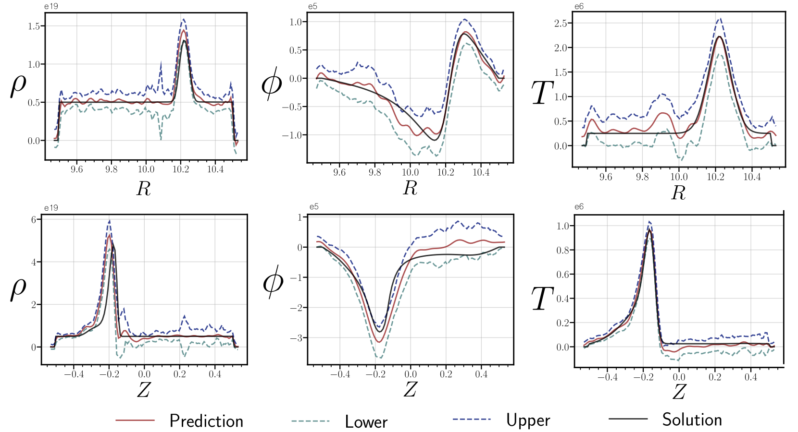
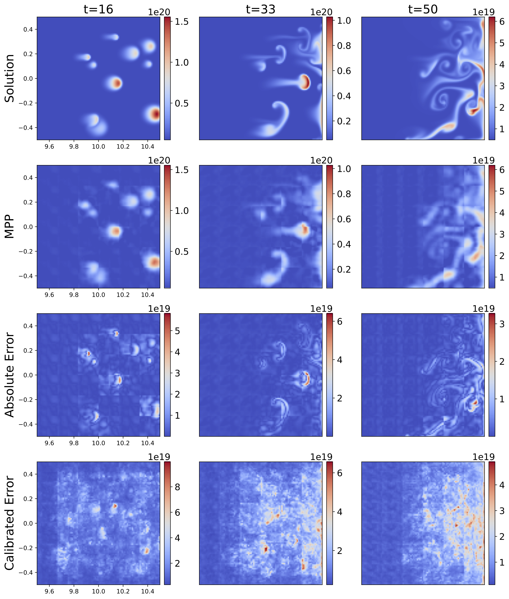
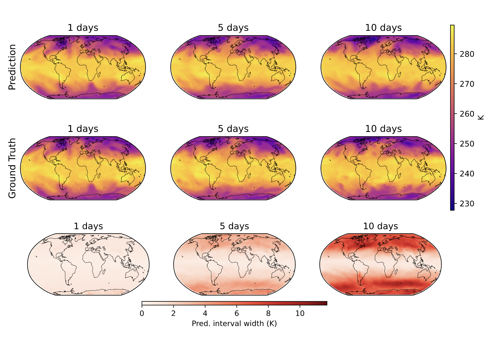
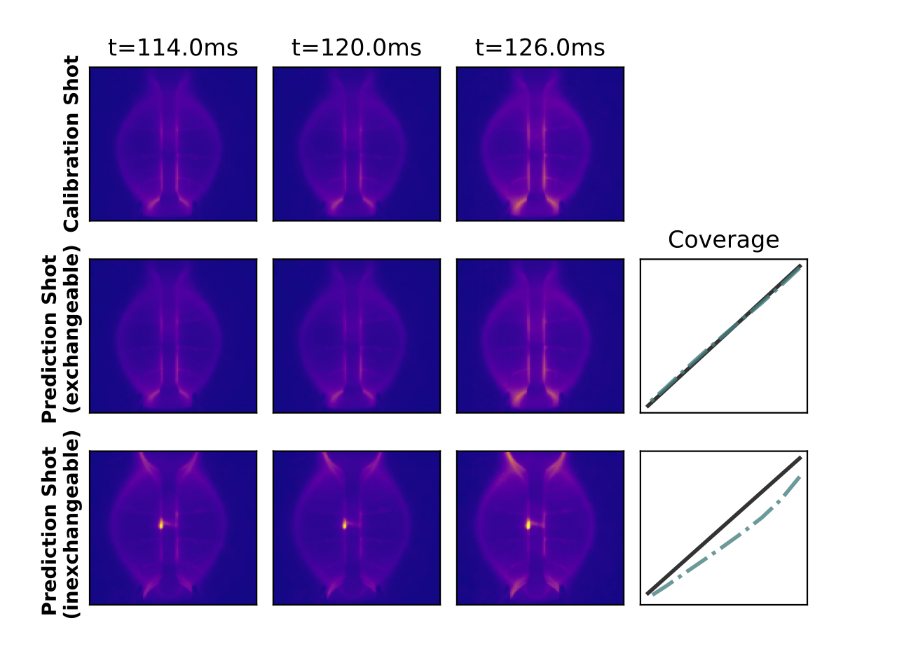

[Vignesh Gopakumar](https://https://vignesh-gopakumar.com/)

[PDF](https://iopscience.iop.org/article/10.1088/2632-2153/ae2e7b/meta) | [Code](https://github.com/gitvicky/Spatio-Temporal-CP/) | [Interactive Demo](https://spatiotemporal-conformal-prediction.streamlit.app/)

## TL;DR

**Problem:** Neural surrogate models for PDEs are fast but provide no reliability guarantees—dangerous for safety-critical applications.

**Solution:** We extend conformal prediction to spatio-temporal domains via cell-wise calibration, providing statistically guaranteed uncertainty bounds.

**Key results:**

- ✅ **Model-agnostic**: Works on any pre-trained model (MLP, U-Net, FNO, ViT, GNN) without modification

- ✅ **Scalable**: Validated from 32 to 20+ million output dimensions

- ✅ **Robust**: Guarantees hold even out-of-distribution

- ✅ **Cheap**: Calibration takes seconds to minutes on a laptop

***

Machine learning has transformed scientific simulation. Neural surrogates [@PIML] can approximate PDEs in milliseconds rather than hours. But there's a catch: these models rarely tell you when they're wrong. In safety-critical applications like fusion reactor control [@gopakumar2023fourierneuraloperatorplasma] or extreme weather prediction [@lam2022graphcast], this blind confidence is borderline problematic. 

In this work, we show that our formulation of **conformal prediction (CP)** [@vovk2005algorithmic; @shafer2008tutorial] provides statistically guaranteed uncertainty bounds for surrogate models across diverse spatio-temporal domains—from simple PDEs to 20 million dimensional weather forecasts—all without retraining or architectural changes.

## The Problem: Fast Predictions, No Guarantees

Surrogate models have become essential tools in scientific computing. They replace expensive numerical solvers with neural networks [@pfaff2021learning; @li2021fourier] that learn input-output mappings from simulation data. Applications span climate modelling, computational fluid dynamics [@carbonfootprint_CFD], and nuclear fusion [@gopakumar2023fourierneuraloperatorplasma]—domains where rapid iteration matters.

The fundamental issue is that these models inherit multiple layers of uncertainty: from the numerical discretisation of the underlying PDEs [@Reddy2006FEM], from finite training data, and from the approximation capacity of the neural architecture itself [@haykin1994neural]. Yet standard neural networks produce point predictions with no indication of reliability. A model trained on laminar flows might confidently—and wrongly—predict turbulent dynamics.

Bayesian methods [@2019MaddoxSWAG; @Chen2021GPPDE] offer one solution, providing posterior distributions over predictions. But they suffer from computational overhead, sensitivity to prior specification, and struggle to scale to the high-dimensional outputs characteristic of spatio-temporal problems.

## Conformal Prediction: Coverage Guarantees in Three Steps

Conformal prediction [@vovk2005algorithmic; @gentle_introduction_CP] answers a simple question: given a trained model and a new input, what's a reasonable range for the true output? The key insight is that we can construct prediction sets $\mathcal{C}^{\alpha}$ satisfying:

$$
\mathbb{P}(Y_{n+1} \in \mathcal{C}^{\alpha}) \geq 1 - \alpha
$$

This guarantee holds *regardless* of model architecture or training procedure—it depends only on the calibration data being exchangeable [@exchangeable] with test data [@vovk2005algorithmic].

*Inductive CP framework [@papadopoulos2008inductive]: (1) Compute nonconformity scores on calibration data, (2) Estimate the quantile for desired coverage, (3) Apply quantile to construct prediction sets.*

The procedure is disarmingly simple:

1. **Calibrate**: Compute nonconformity scores $s(x,y) = |y - \hat{f}(x)|$ on held-out calibration data
2. **Estimate quantile**: Find $\hat{q}$ such that $(1-\alpha)$ of calibration scores fall below it
3. **Predict**: For new input $x$, the prediction set is $\hat{f}(x) \pm \hat{q}$

The computational cost? Negligible—just sorting and a quantile lookup.

## Extending to Spatio-Temporal Domains

Scientific surrogate models don't predict scalars; they predict entire fields evolving in space and time. A weather model [@lam2022graphcast] might output temperature, pressure, and wind across a global grid at multiple lead times: millions of dimensions.

Our key extension is **cell-wise calibration**. For a model mapping inputs $X \in \mathbb{R}^{T_{\text{in}} \times N_x \times N_y}$ to outputs $\tilde{Y} \in \mathbb{R}^{T_{\text{out}} \times N_x \times N_y}$, we compute quantiles $\hat{q}$ independently at each grid point, preserving the tensorial structure:

$$
\mathbb{E}\big[ (Y_{n+1} \geq L) \wedge (Y_{n+1} \leq U) \big] \geq 1 - \alpha
$$

where $L$ and $U$ form the lower and upper bounds at each cell. This provides marginal coverage at every spatial and temporal location.

*Cell-wise uncertainty calibration for a U-Net modelling the wave equation out-of-distribution. Top rows: ground truth and prediction. Bottom: MC dropout (uncalibrated, underestimates uncertainty) vs CP (calibrated, correctly identifies high-uncertainty regions).*

## Three Nonconformity Scores

The choice of nonconformity score determines how prediction sets adapt to input difficulty:

**Absolute Error Residual (AER)** [@error_residual]: The simplest approach—use $s(x,y) = |y - \hat{f}(x)|$ from any deterministic model. No modifications needed, computationally cheapest. The catch: error bars are input-independent.

**Conformalised Quantile Regression (CQR)** [@conformalized_quantile_regression]: Train three models to predict lower, median, and upper quantiles [@koenker_2005]. The score measures distance to the nearest bound: $s(x,y) = \max\{\underline{f}(x) - y, y - \overline{f}(x)\}$. Initially developed method that requires multiple models [@conformalized_quantile_regression]. 

**Standard Deviation (STD)**: For probabilistic models outputting mean $\mu(x)$ and standard deviation $\sigma(x)$, use $s(x,y) = |y - \mu(x)|/\sigma(x)$. The prediction set becomes $\mu(x) \pm \hat{q}\sigma(x)$—bounds that scale with model uncertainty.

## Experiments: From Poisson to Planet-Scale Weather

We validate the framework across applications of increasing complexity ranging from 1D static PDEs, complex fluid flow to planet-scale weather modelling and diagnostic modelling within fusion reactors. We notice that irrespective of the choice of model, nonconformity score, we observe near perfect calibrated error bars. 

| Case | Model | Output Dims | Calib. (%) | Cal. Time (s) |
|------|-------|-------------|------------|---------------|
| 1D Poisson | MLP | 32 | 90.05 | 0.003 |
| 1D Conv-Diff | U-Net | 2,000 | 92.60 | 8.30 |
| 2D Wave | U-Net | 32,670 | 94.91 | 3.52 |
| 2D Wave | FNO [@li2021fourier] | 65,340 | 89.24 | 34.18 |
| 2D Navier-Stokes* | FNO [@li2021fourier] | 40,960 | 90.08 | 4.83 |
| 2D MHD | FNO [@li2021fourier] | 1,348,320 | 90.18 | 359 |
| 2D MHD | ViT (PT) [@mccabe2023multiple] | 313,344 | 89.95 | 2981 |
| 2D MHD | ViT (FT) [@mccabe2023multiple] | 313,344 | 89.78 | 2079 |
| 2D Camera | FNO [@li2021fourier] | 2,867,200 | 91.28 | 294 |
| Weather (Limited Area) | GNN [@neural_lam] | 20,602,232 | 91.19 | 229 |
| Weather (Global) | GNN [@neural_lam] | 12,777,600 | 90.03 | 366 |
*Coverage obtained when evaluated for alpha=0.1 (target coverage of 90%) across all of our experiments. We observe ~90% empirical coverage. Calibration times range from milliseconds to minutes—on standard laptop hardware.*

*Empirical coverage vs target coverage across experiments. All methods achieve near-perfect coverage along the diagonal.*

<a href="https://spatiotemporal-conformal-prediction.streamlit.app/" target="_blank">### Interactive Demo: Poisson Equation </a>

### Magnetohydrodynamics: Multi-Variable Plasma Dynamics

For nuclear fusion applications, we model coupled density-potential-temperature dynamics in a tokamak using data from the JOREK MHD code [@Hoelzl2021jorek]. The FNO [@li2021fourier] processes 1.35 million output dimensions, predicting plasma blob evolution across a 106×106 toroidal grid.

*Spatial profiles at timestep 20 showing 90% coverage for multi-variable MHD predictions. CP accurately captures sharp plasma blob features across all three coupled variables.*

### Foundation Models: Zero-Shot and Fine-Tuned

We apply CP to the Multi-Physics Pre-trained Vision Transformer (MPP-AViT) [@mccabe2023multiple]—a foundation model trained on diverse PDEs. For zero-shot inference on MHD data (a physics regime never seen during training), CP quantifies the substantial prediction uncertainty. After fine-tuning, error bars tighten appropriately.

*Zero-shot foundation model on out-of-distribution MHD. Despite no training on this physics, the model captures major features. CP quantifies prediction uncertainty with guaranteed coverage.*

### Weather Forecasting: 20 Million Dimensions

The ultimate stress test: probabilistic weather prediction using Graph Neural Networks [@neural_lam]. We calibrate error bars for both limited-area (Nordic region, 20M dimensions) and global forecasting (13M dimensions) using the NeuralLAM architecture [@neural_lam].

*Prediction (top), Ground Truth (middle) and width of the error bars (bottom) at calibrated for 85% coverage Temperature at 700 hPa is being modelled. Our framework rightfully captures the growing uncertainty that is characteristic of autoregressive spatio-temporal models*

### Fusion Camera Diagnostics

We apply CP to FNO [@li2021fourier] predictions of plasma evolution from fast-visible camera imagery on the MAST tokamak [@gopakumar2023fourierneuraloperatorplasma]. The model forecasts 10 frames (12ms) of plasma dynamics from 10 input frames, validated against experimental data.

*The method provides exact empirical coverage when the plasma shots are exchangeable (from a similar plasma phenomenon), whereas they fail when the shots are from a different plasma regime.*

## Limitations and Practical Guidance

CP provides *marginal* coverage [@gentle_introduction_CP] validity averaged over all predictions not *conditional* coverage for each individual input. In practice, 90% of predictions are covered on average, but any specific prediction may deviate.

Our cell-wise formulation treats each grid point independently, ignoring spatial correlations inherent in physical systems. This may produce overly conservative joint coverage or miss spatially coherent error patterns.

For deterministic models with AER scores [@error_residual], error bars are input-independent constants. Probabilistic models (STD) provide input-adaptive bounds but require architectural modifications.

**Practical recommendations:**
- Validate exchangeability assumptions [@exchangeable] through sensitivity analyses (or vice-versa could use this method to test exchangeability)
- Use conservative $\alpha$ values for safety-critical applications
- Prefer probabilistic models when input-dependent bounds matter
- Ensure calibration data adequately spans the deployment regime

## Conclusion

Conformal prediction [@vovk2005algorithmic; @gentle_introduction_CP] offers something rare in uncertainty quantification: finite-sample, distribution-free guarantees that scale to production-grade surrogate models. The method is model-agnostic, computationally trivial, and works across architectures from MLPs to foundation models [@mccabe2023multiple].

For practitioners deploying surrogates in safety-critical domains, CP provides a practical tool to answer the question that matters most: *can I trust this prediction?*

