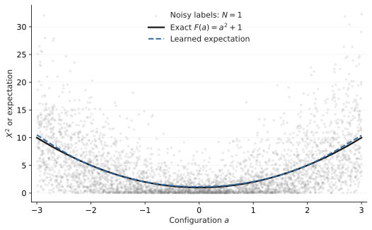

## Convergence is expensive

Consider a family of expectations indexed by a configuration $a$:

$$
F(a)=\mathbb E_{\xi\sim p(\cdot\mid a)}[f(a,\xi)].
$$

For one configuration, the usual Monte Carlo (MC) estimator is

$$
\hat F_N(a)=\frac{1}{N}\sum_{i=1}^{N}f(a,\xi_i),
\qquad \xi_i\overset{\mathrm{iid}}\sim p(\cdot\mid a).
$$

Under standard integrability assumptions, increasing $N$ makes this estimate converge to $F(a)$. The computational objective is local: spend enough samples to resolve one expectation. With finite variance, its root-mean-squared error decreases as $N^{-1/2}$.

The objective changes when we need $F(a)$ across many configurations. We might evaluate different material properties, source distributions, or model parameters, then fit a surrogate $G_\theta(a)$ for repeated use. Generating a converged label at every configuration can dominate the entire cost. Under a fixed simulation budget, we can instead generate accurate labels at a few configurations or noisy labels at many.

**Must each Monte Carlo estimate converge before it becomes useful training data?**

For squared-error regression, the answer is no, provided the estimator is conditionally unbiased. The relevant object is the expectation of the label given the configuration, rather than the accuracy of any individual label. This permits convergence to be shared across related problems when the model can exploit their common structure.

We encountered this question while training neural operators from noisy particle-transport simulations in PTNO [@cao2026ptno]. Here, we develop the general statistical argument, its finite-budget implications, and the complication introduced by nonlinear targets. The premise is that the map $a\mapsto F(a)$ has learnable structure; unbiasedness alone does not supply that structure.

## Learning from an unconverged estimator

Write the stochastic label as

$$
\hat F_N(a)=F(a)+\epsilon_N(a),
\qquad \mathbb E[\epsilon_N\mid a]=0.
$$

Let configurations follow a fixed distribution $\rho$. Assume finite second moments and that $G_\theta$ receives $a$, without access to the random draws used to produce its label. Define the noisy and clean population risks over the same model class:

$$
\begin{aligned}
\mathcal L_N(\theta)
&=\mathbb E_{a,\xi}\big[(G_\theta(a)-\hat F_N(a))^2\big],\\
\mathcal L_{\mathrm{clean}}(\theta)
&=\mathbb E_a\big[(G_\theta(a)-F(a))^2\big].
\end{aligned}
$$

Expanding the square gives

$$
\begin{aligned}
\mathcal L_N(\theta)
&=\mathcal L_{\mathrm{clean}}(\theta)
 +\mathbb E[\epsilon_N^2]\\
&\quad-2\mathbb E[(G_\theta(a)-F(a))\epsilon_N].
\end{aligned}
$$

The cross term vanishes by conditioning on $a$:

$$
\mathbb E[(G_\theta(a)-F(a))\epsilon_N]
=\mathbb E_a[(G_\theta(a)-F(a))\mathbb E[\epsilon_N\mid a]]=0.
$$

Hence $\mathcal L_N=\mathcal L_{\mathrm{clean}}+\mathbb E[\epsilon_N^2]$. The additional term does not depend on $\theta$, so, whenever minimizers exist,

$$
\boxed{\begin{gathered}
\arg\min_\theta\mathcal L_N(\theta)\\
=\arg\min_\theta\mathcal L_{\mathrm{clean}}(\theta).
\end{gathered}}
$$

This identity holds even for a restricted model class. Such a class may approximate $F$ imperfectly, but noisy supervision introduces no additional displacement of its population optimum. For vector or field outputs, replacing the scalar square by a squared Euclidean or Hilbert-space norm gives the same argument, assuming finite expected squared norm.

The result concerns a population objective. It neither guarantees that a finite dataset identifies $F$ nor that an optimizer reaches the optimum. High-variance labels can increase gradient variability, and a sufficiently flexible model can memorize their noise. The training distribution also matters: the identity gives no assurance of extrapolation beyond its support.

Noise2Noise established this learning principle in image restoration, including MC rendering [@lehtinen2018noise2noise]. Its denoising setting also involves corrupted inputs; here the input is a configuration and the output is its deterministic expectation. In both cases, the mean-preserving condition must hold given the information actually supplied to the model. Unconditional zero-mean noise is insufficient if its conditional mean varies with the input.

## Two deliberately noisy Monte Carlo examples

First consider an analytical expectation:

$$
X\mid a\sim\mathcal N(a,1),\qquad
F(a)=\mathbb E[X^2\mid a]=a^2+1.
$$

The training label is the sample mean of $X^2$. Even with $N=1$, it is unbiased:

$$
\hat F_1(a)=X^2,\qquad
\operatorname{Var}[\hat F_N(a)\mid a]=\frac{2+4a^2}{N}.
$$

At $a=3$, one label has standard deviation $\sqrt{38}$ around a mean of $10$. At $a=0$, its standard deviation is $\sqrt{2}$ around a mean of $1$. Individual labels are therefore poor approximations, with noise that changes across the configuration space.

We draw $4,096$ configurations uniformly from $[-3,3]$, generate one sample at each, and train a two-hidden-layer MLP with 32 tanh units per layer. Training uses only these noisy labels: full-batch Adam, learning rate $0.01$, and 800 updates on CPU. Fixed linear input and output rescaling improves conditioning without changing the population optimum. The analytical target is used only for plotting and evaluation; there is no clean-label stopping rule or hyperparameter sweep.

{#fig-noisy-expectation fig-alt="Grey one-sample squared-Gaussian labels scatter around a quadratic. A blue dashed learned curve closely follows the black exact expectation." width=100%}

The model pools evidence through a shared function of $a$. It does not estimate each configuration independently, and it has no information about which realization of $X$ produced a particular label. Its useful prediction is the conditional mean. This pooling is possible because the expectation map is simple relative to the information available across configurations.

### From individual trajectories to transport expectations

A symmetric random walk supplies a discrete transport example. Start at an integer site $x\in\{1,\ldots,L-1\}$, move left or right with equal probability, and stop at the first visit to either boundary. Let $\tau$ be this exit time and $H=\mathbf 1\{X_\tau=L\}$. Their expectations are [@aldous2002walks, §5.1]

$$
\mathbb E[H\mid x]=\frac{x}{L},
\qquad
\mathbb E[\tau\mid x]=x(L-x).
$$

One complete trajectory therefore provides two unbiased labels: a binary exit outcome and a noisy duration. Their sample averages estimate the escape probability and mean exit time at a given starting site. Generating these labels requires neither analytical expectation.

```python
def walk_label(x, rng, length=32):
    steps = 0
    while 0 < x < length:
        x += rng.choice([-1, 1])
        steps += 1
    return int(x == length), steps
```

We set $L=32$ and generate 4,096 independent trajectories, with starting sites sampled uniformly from the 31 interior sites. Sites recur: these are 4,096 observations, rather than 4,096 distinct configurations. A two-output $1\to32\to32\to2$ tanh MLP learns both expectations using the same Adam settings and 800 updates as above. The input is scaled by $L$ and the duration label by $L^2$, using fixed linear transformations. Exact solutions enter only evaluation and plotting.

{#fig-random-walk fig-alt="Two panels compare exact and learned random-walk expectations across starting sites: a linear escape probability and a parabolic mean exit time, with scattered site-wise mean labels." width=100%}

Across seeds 0–7, the relative errors are $1.66\pm0.45\%$ for escape probability and $3.87\pm1.07\%$ for mean exit time (mean ± sample SD). This finite configuration space illustrates pooling across sites; it does not establish an efficiency advantage over direct simulation. Trajectory counts also conceal variable costs: the seed-0 dataset contains 716,131 transitions. Every trajectory reaches a boundary without a time cutoff.

The explorer below uses the saved weights from all eight fits. Change the starting site, trajectory count, or displayed quantity; resample to see MC variability, or animate the addition of complete trajectories. The selected learned map stays fixed while the MC estimate changes.



## Where should the simulation budget go?

Let $M$ denote distinct configurations, $N$ samples per estimator, and $K$ independent estimators at each configuration. If each simulated sample has equal cost, the simulation budget is

$$
\boxed{B=MKN.}
$$

More computation can buy convergence within a configuration or coverage across configurations. If one sample has conditional variance $\sigma^2(a)$, then

$$
\operatorname{Var}\!\left[
\frac{1}{K}\sum_{k=1}^{K}\hat F_N^{(k)}(a)\,\middle|\,a
\right]=\frac{\sigma^2(a)}{NK}.
$$

For an ordinary sample mean, $N$ and $K$ therefore buy precision at known locations. Increasing $M$ exposes more of the shape of $F$. At fixed predictions, the sum of squared residuals against $K$ labels equals $K$ times the residual against their average, plus a term independent of the prediction. Their squared-loss information at that location is thus captured by the average, although stochastic optimization can depend on how those labels are presented.

This is the established **replication versus exploration** problem in stochastic simulation. Stochastic kriging separates simulator noise from uncertainty about a response surface [@ankenman2010kriging]. Sequential design methods explicitly decide whether to repeat an existing configuration or evaluate a new one [@binois2019replication]. Neural expectation-map learning changes the surrogate class, while retaining this design question.

We compare three allocations with $B=4,096$ and $K=1$, using the same Gaussian problem, architecture, and training settings. Each allocation is run for seeds 0–7. Within each seed, model initialization and the underlying random-number streams are shared across allocations, while grouping into configurations changes. Every fit consumes exactly 4,096 simulated samples. Reusing the resulting labels during optimization incurs training computation but no additional simulation draws.

![Equal simulation budgets yield different errors. Grey points show all eight seeds and blue diamonds show their means. Error is evaluated against the exact expectation on 1,001 equally spaced configurations in $[-3,3]$. This is a comparison of simulation allocations, not equal training wall time.](assets/learning_from_convergence/budget_allocation.svg){#fig-budget-allocation fig-alt="Three groups of seed-wise mean-squared errors compare allocations 4096 by 1, 512 by 8, and 64 by 64. Their errors overlap; the last allocation has the lowest mean." width=100%}



Here, $N=1$ produces an accurate expectation map, but the lowest mean error occurs at $(M,N)=(64,64)$. The distributions overlap substantially, and eight seeds provide limited evidence for ranking allocations. This smooth, one-dimensional problem offers little basis for assuming that 64 configurations leave a severe coverage deficit. The experiment illustrates the feasibility of noisy supervision and the dependence of finite-budget performance on the learning setup.

PTNO reports that broader coverage improves its controlled transport allocation study until coverage saturates [@cao2026ptno]. CTMC moment-map learning similarly distinguishes the allocation needs of mean and transformed covariance targets [@pratt2026moments]. These observations motivate studying coverage; they do not imply that $N=1$ is universally optimal.

**Unbiasedness tells us where the population optimum is. It does not tell us the most efficient finite-budget path for reaching it.** That path depends on map complexity, input dimension, heteroskedasticity, model capacity, optimization, and whether additional configurations remain informative. Configuration setup costs and variable trajectory lengths can also make $MKN$ an incomplete measure of actual compute.

## Unbiasedness is fragile under nonlinear transformations

Suppose the desired output is $g(F(a))$. Regressing directly against $g(\hat F_N(a))$ gives the squared-loss population target

$$
\mathbb E[g(\hat F_N(a))\mid a],
$$

which generally differs from $g(F(a))$. Increasing the number of configurations can improve estimation of this transformed conditional mean while leaving its discrepancy from the desired target intact.

For a positive estimator and an integrable logarithm, Jensen's inequality gives

$$
\mathbb E[\log\hat F_N(a)\mid a]
\leq \log F(a).
$$

The inequality is strict for a nonconstant estimator. The Gaussian example makes the difference explicit without fitting another model. At $a=0$ and $N=1$, $\hat F_1=Z^2$ for $Z\sim\mathcal N(0,1)$. Since $Z^2$ has a chi-squared distribution with one degree of freedom,

$$
\begin{aligned}
\log\mathbb E[\hat F_1]&=0,\\
\mathbb E[\log\hat F_1]
&=-\gamma-\log 2\approx-1.27036,
\end{aligned}
$$

where $\gamma$ is the Euler–Mascheroni constant and $\log$ denotes the natural logarithm.[^log-moment] Using 200,000 independent diagnostic draws, the companion code obtains $0.00003$ for the log of the sample mean and $-1.27193$ for the mean log, with standard error $0.00497$ for the latter. These draws are separate from the training budgets.

[^log-moment]: Differentiate $\mathbb E[(Z^2)^t]=2^t\Gamma(t+1/2)/\Gamma(1/2)$ at $t=0$ and use $\psi(1/2)=-\gamma-2\log 2$ ([NIST DLMF, Eq. 5.4.13](https://dlmf.nist.gov/5.4#E13)).

PTNO retains noisy targets in physical space to avoid this label-transformation bias; its prediction-normalized, stop-gradient loss requires a separate gradient analysis from ordinary squared-loss risk equivalence [@cao2026ptno]. Nonlinear Noise2Noise studies how nonlinear maps and loss choices affect the Jensen gap in MC denoising [@tinits2025nonlinear]. Positivity of a prediction and transformation of a noisy target are different operations: a positive output parameterization can still be compared to the original unbiased label.

The logarithm also requires care when an estimator can be zero or negative. Adding a floor makes it defined but changes the target again. A nonlinear transformation may be computationally useful; it simply needs its own statistical justification.

## Learn primitive expectations first

A nonlinear formula can turn unbiased MC estimates into a biased training label. When the desired quantity combines several expectations, a useful alternative is to learn those expectations separately and apply the formula to their predictions. We call these component expectations **primitives**:

$$
\boxed{\begin{gathered}
\text{Learn primitives}\\
\text{from unbiased labels;}\\
\text{compose afterwards.}
\end{gathered}}
$$

Variance makes the importance of this order explicit. Its primitives are the mean and second raw moment:

$$
\begin{aligned}
m_1(a)&=\mathbb E[X\mid a],\\
m_2(a)&=\mathbb E[X^2\mid a],\\
V(a)&=m_2(a)-m_1(a)^2.
\end{aligned}
$$

Given $N$ independent draws at $a$, the sample averages $\hat m_1=N^{-1}\sum_i X_i$ and $\hat m_2=N^{-1}\sum_i X_i^2$ are unbiased labels for their respective moments. Combining them into a variance label introduces bias. Writing $m_1=m_1(a)$ and $V=V(a)$, squaring the noisy mean adds its sampling variance:

$$
\begin{aligned}
\mathbb E[\hat m_1^2\mid a]
&=m_1^2+\frac{V}{N},\\
\mathbb E[\hat m_2-\hat m_1^2\mid a]
&=\left(1-\frac1N\right)V.
\end{aligned}
$$

**With one sample, the plug-in variance label is always zero**, even when the true variance is positive:

$$
\begin{aligned}
\hat m_1&=X,\qquad \hat m_2=X^2,\\
\hat m_2-\hat m_1^2&=X^2-X^2=0.
\end{aligned}
$$

Squared-loss training on these variance labels therefore targets zero at every configuration. Increasing the number of training observations cannot repair this target bias.

Instead, use $X$ and $X^2$ as two separate labels, with $a$ as the model input. Their conditional means remain $m_1(a)$ and $m_2(a)$, even for $N=1$. Learning pools noisy observations across configurations to estimate these means. Only then form

$$
V_\theta(a)=G_2(a)-G_1(a)^2.
$$

For the Gaussian example, the exact learned targets would be $G_1(a)=a$ and $G_2(a)=a^2+1$, recovering $V(a)=1$. The distinction is between applying the variance formula to individual noisy estimates and applying it to learned conditional expectations.

An unbiased direct variance label is also valid. For $N>1$, the usual sample variance with Bessel's correction can be learned directly. In the CTMC moment-map paper, the additional bias arises from preprocessing and Cholesky factorization of an unbiased sample covariance [@pratt2026moments]. Learning primitives is an option when the proposed label construction is biased.

The same reasoning applies to a ratio $R(a)=A(a)/D(a)$. Even with unbiased component estimates, generally

$$
\mathbb E\!\left[\frac{\hat A}{\hat D}\,\middle|\,a\right]
\ne\frac{A(a)}{D(a)}.
$$

Learn the numerator and denominator expectations separately, then evaluate $R_\theta(a)=G_A(a)/G_D(a)$. This avoids using the random ratio as the training label. Approximation error remains: if $G_A=A+e_A$ and $G_D=D+e_D$, then

$$
R_\theta-\frac{A}{D}
=\frac{D e_A-A e_D}{D(D+e_D)}.
$$

Small denominator errors can therefore be amplified when $D$ is small. Likewise, approximate raw moments can produce negative variances or lose precision through cancellation. **Learning primitives avoids this source of label bias; it does not guarantee an accurate composed prediction.** Unbiased labels preserve the population target, while finite models still require accuracy and structural checks for the final quantity.

## Where the simple theory breaks

The key assumption is conditional unbiasedness for the quantity we actually want. Four common cases violate it or require additional analysis.

1. **Ordinary finite-run MCMC.** A chain initialized away from stationarity generally produces biased finite-run averages. Starting in stationarity removes that initialization bias, although correlations change variance. Coupled MCMC methods can construct unbiased alternatives under suitable conditions [@jacob2020couplings].

2. **Self-normalized or ratio estimators.** Dividing random numerator and denominator estimates generally introduces finite-sample bias, even when each component is unbiased. More configurations do not remove a conditional bias that remains at every configuration.

3. **Nested Monte Carlo.** For $\mathbb E_X[g(\mathbb E[Y\mid X])]$, replacing the inner expectation by a finite sample average before applying $g$ usually creates bias. Increasing only the outer sample count can converge to the wrong quantity. Valid convergence conditions and budget allocations depend on the nesting structure [@rainforth2018nesting].

4. **Biased simulators.** A discretized SDE solver, truncated trajectory, or approximate physical model may estimate a different expectation. The model can learn that simulator's mean accurately without recovering the intended continuum or physical target. PTNO explicitly identifies truncation and approximate-physics bias as limitations [@cao2026ptno].

The appropriate decomposition becomes

$$
\hat F_N(a)=F(a)+b_N(a)+\epsilon_N(a),
\qquad \mathbb E[\epsilon_N\mid a]=0.
$$

Squared-loss learning now targets $F+b_N$, or its best approximation in the chosen model class. Coverage can reduce error in learning this biased mean, but cannot identify $F$ separately from $b_N$ without additional information. Increasing fidelity, constructing a debiased estimator, or supplying a model of the bias changes the statistical problem; collecting more labels at unchanged fidelity does not.

## How this connects to existing work

The literature separates naturally by what is learned. Noise2Noise learns restoration from noisy supervision, and stochastic metamodeling learns a simulator response surface while accounting for observation noise [@lehtinen2018noise2noise; @ankenman2010kriging; @binois2019replication]. These supply the statistical and experimental-design foundations.

Learned Monte Carlo methods instead improve the estimator used at inference. Amortized MC Integration learns proposals tailored to components of an expectation, and Target-Aware Bayesian Inference exploits the function being integrated [@golinski2019amortized; @rainforth2020target]. Neural Control Variates learns an integrable approximation and samples a residual correction to reduce variance [@mueller2020control]. These approaches retain a stochastic computation at inference, with estimator properties determined by their correction and normalization schemes.

Direct expectation-map learning produces an approximate deterministic response at inference. Its closest recent precedents here are WoS-NO, which uses stochastic walk-on-spheres supervision for PDE solution operators, CTMC moment-map learning, and PTNO [@viswanath2026wos; @pratt2026moments; @cao2026ptno]. WoS-NO also reports implementation bias from early termination and caching, underscoring the distinction between an ideal stochastic representation and its implemented estimator.

The broader viewpoint proposed here connects these settings through conditional means and budget allocation. It makes no novelty claim for noisy regression, replication versus exploration, or amortized integration. Its open question is when shared structure makes learning the expectation itself an efficient use of stochastic computation.

## A broader hypothesis

The favorable case is a primitive expectation $F(a)=\mathbb E[X\mid a]$ with unbiased, finite-variance labels and a learnable configuration map. Nonlinear quantities introduce further questions:

$$
\begin{gathered}
\mathbb E[X\mid a],\\
g(\mathbb E[X\mid a]),\\
g(\mathbb E[X_1\mid a],\ldots,\mathbb E[X_k\mid a]),\\
\mathbb E_{X\mid a}[g(\mathbb E[Y\mid X,a])],\\
\hat F_N(a)=F(a)+b_N(a)+\epsilon_N(a).
\end{gathered}
$$

Learning primitive expectations can help with the middle cases, provided composition is stable. Nested expectations and simulator bias require additional assumptions or constructions. Across this hierarchy, unbiasedness, learnability, numerical stability, and computational efficiency remain separate requirements.

The research hypothesis is that convergence can sometimes be amortized across a family of configurations instead of achieved independently within each one. Establishing when this is beneficial requires a theory of allocation that accounts for coverage, estimator noise and bias, approximation error, and training cost. Can such a theory tell us when stochastic computation should converge locally, and when its convergence can be shared across related problems?

[Reproduce the figures and numerical checks](https://github.com/gitvicky/learning-from-convergence) · [Back to the blog](/Blog/blog.qmd)

## References

::: {#refs}
:::
