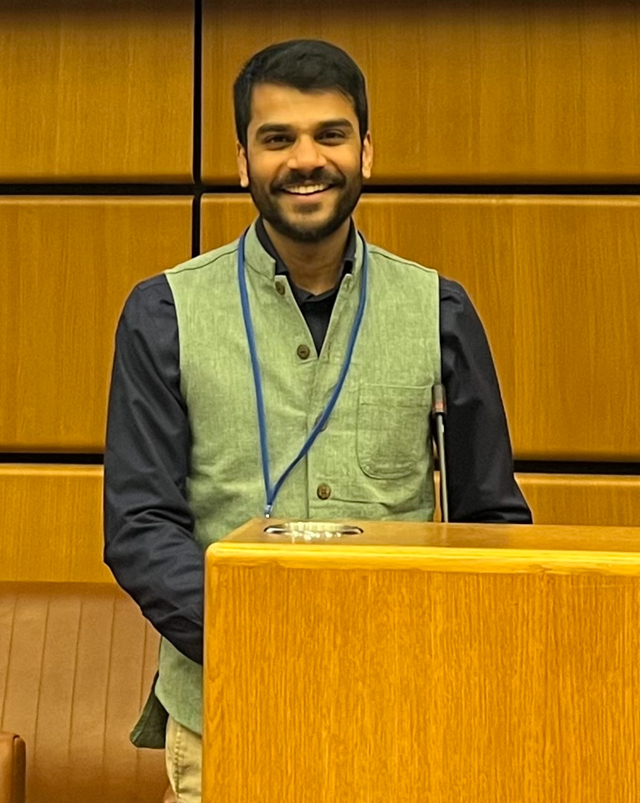

Vignesh Gopakumar

<!-- 
Exploring the physics of the universe, one neural network at a time
 -->

<a href="https://www.linkedin.com/in/vignesh-gopakumar/" target="_blank" style="margin-right: 15px;"><i class="bi bi-linkedin"></i> LinkedIn</a>
<a href="https://x.com/mistervickster" target="_blank" style="margin-right: 15px;"><i class="bi bi-twitter"></i> Twitter</a>
<a href="https://scholar.google.com/citations?user=NQtqemwAAAAJ&hl=en" target="_blank" style="margin-right: 15px;"> Scholar</a>
<a href="https://github.com/gitvicky" target="_blank" style="margin-right: 15px;"><i class="bi bi-github"></i> GitHub</a>
<a href="mailto:vignesh7g@gmail.com"><i class="bi bi-envelope"></i> Email</a>

I am a senior research scientist at the [UK Atomic Energy Authority](https://ccfe.ukaea.uk/) (UKAEA), where I lead a team developing "actionable" surrogate models for exascale simulations and data-driven models for the Fusion industry. My research focusses on enhancing machine learning models' performance, robustness and interpretability through physics-based approaches.

I am also a visiting researcher with the [SciML group at STFC's Rutherford Appleton Laboratory](https://www.scd.stfc.ac.uk/Pages/Scientific-Machine-Learning.aspx).

Concurrently, I'm pursuing a PhD in Machine Learning under [Marc Deisenroth](https://www.deisenroth.cc/) in the [Sustainability and Machine Learning Group](https://www.sml-group.cc/) at [University College London](https://www.ucl.ac.uk/ai-centre/).

Physics-Informed ML
Continuous Dynamics
Uncertainty Quantification
Design of Experiments

**Building [simvue.io](https://simvue.io)** — An AI-driven, open-source simulation management and tracking dashboard for streamlining engineering workflows. Developed with public funding from the UK Government. Currently in private $\beta$.

> *"If there is a God, it must be a differential equation"* — Bertrand Russell
