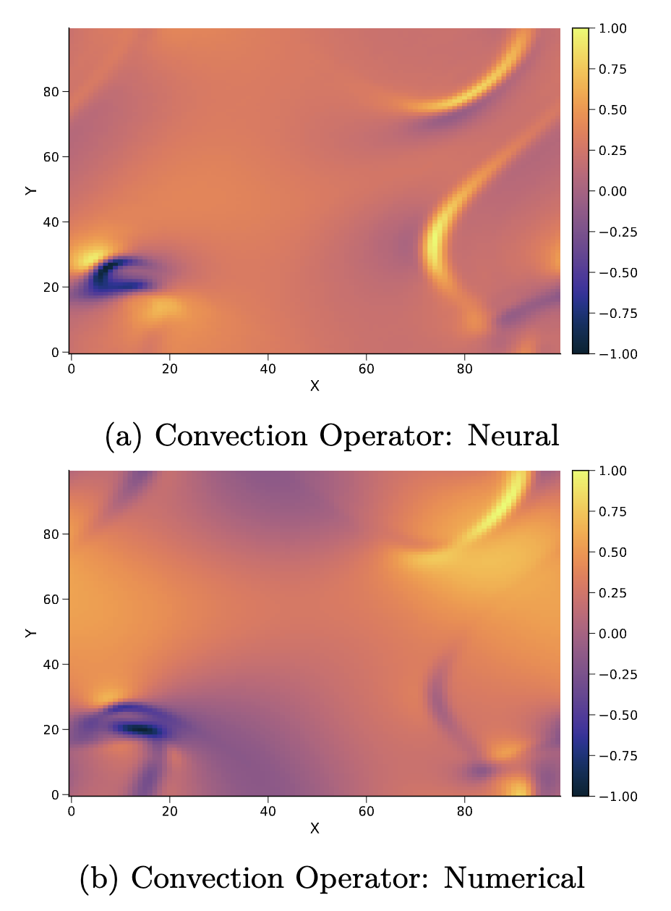
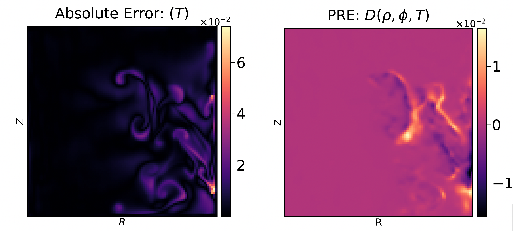
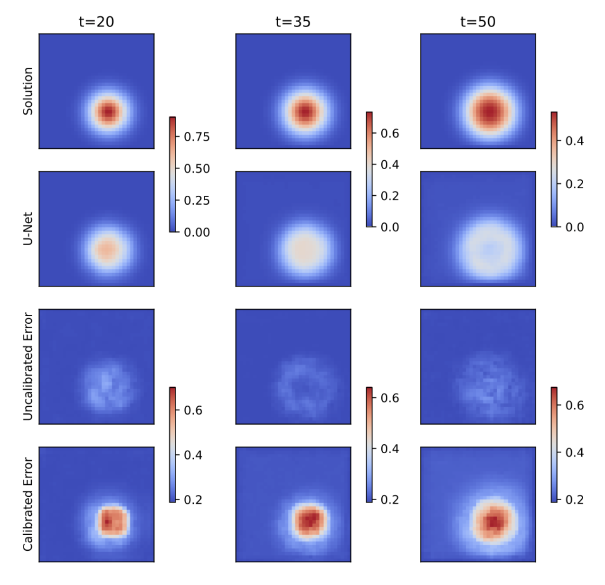
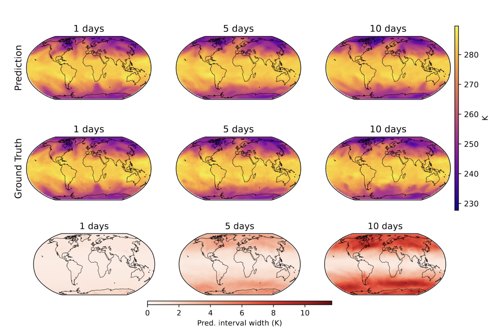
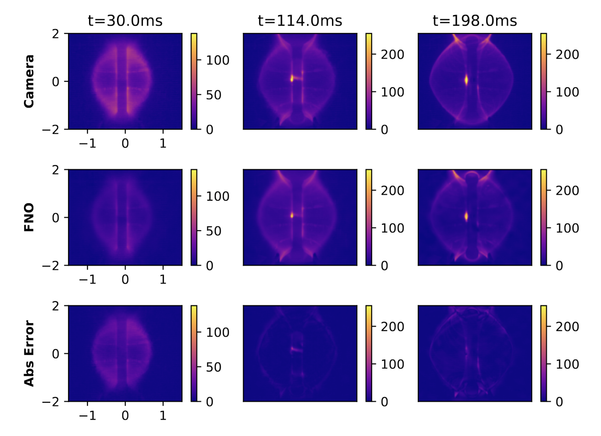
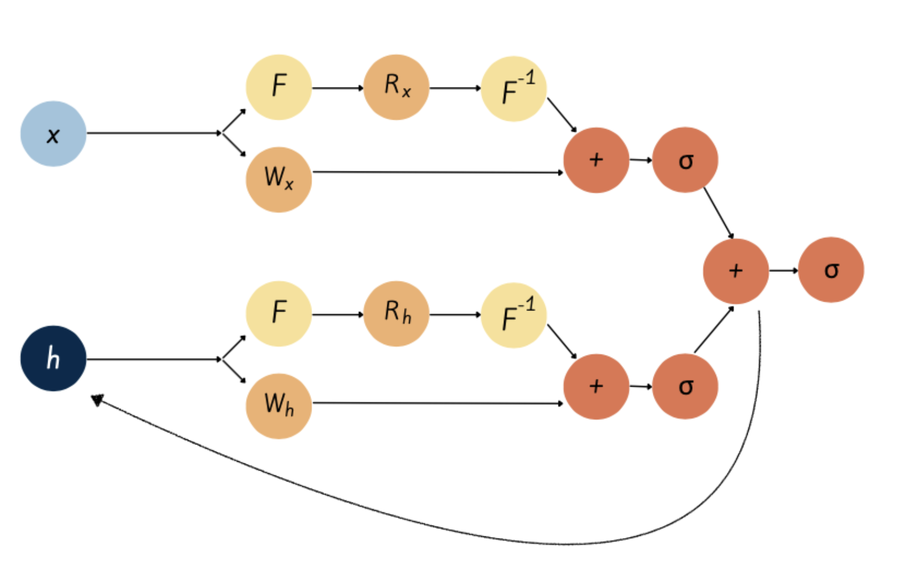
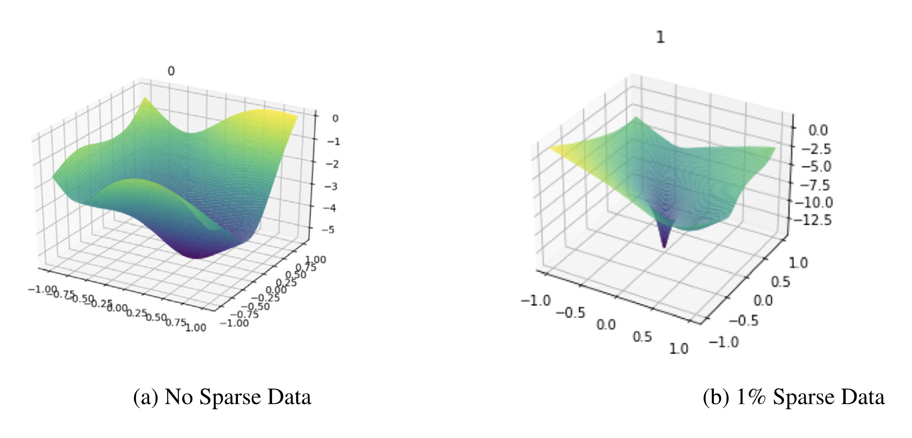
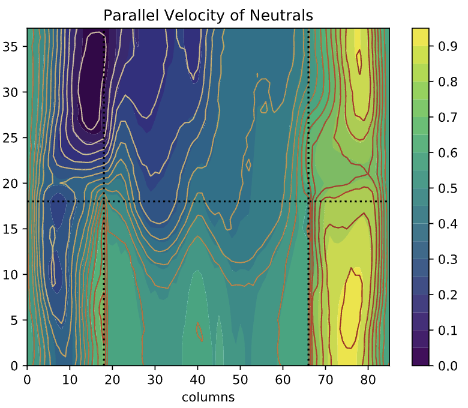

---

Few selected publications are given below. You can find the latest list of publications in my [Google Scholar page.](https://scholar.google.com/citations?user=NQtqemwAAAAJ&hl=en)

2026

Learning Physical Operators using Neural Operators

Vignesh Gopakumar, Ander Gray, Daniel Giles, Lorenzo Zanisi, Matt J. Kusner, Timo Betcke, Stanislas Pamela, Marc Peter Deisenroth — <em>AISTATS, 2026</em>

OpsSplit introduces a physics-informed machine learning framework that decomposes partial differential equations into fixed linear approximations and learned non-linear neural operators within a Neural ODE, delivering superior generalization to unseen physics, parameter efficiency, and interpretability.

<a href="https://arxiv.org/abs/2602.23113" class="btn-paper" target="_blank">Paper</a>
<a href="https://github.com/gitvicky/NOs_for_POs" class="btn-code" target="_blank">Code</a>

{.lightbox}

2025

Calibrated Physics-Informed Uncertainty Quantification

Vignesh Gopakumar, Ander Gray, Lorenzo Zanisi, Timothy Nunn, Daniel Giles, Matt J. Kusner, Stanislas Pamela, Marc Peter Deisenroth — <em>ICML, 2025</em>

Calibrated uncertainty quantification of neural PDE solvers using physics residual errors as non-conformity scores for data-free conformal prediction.

<a href="https://openreview.net/pdf?id=Z2uLBBck2X" class="btn-paper" target="_blank">Paper</a>
<a href="https://github.com/gitvicky/CP-PRE" class="btn-code" target="_blank">Code</a>

{.lightbox}

2024

Uncertainty Quantification of Surrogate Models using Conformal Prediction

Vignesh Gopakumar, Ander Gray, Joel Oskarsson, Lorenzo Zanisi, Daniel Giles, Matt J. Kusner, Stanislas Pamela, Marc Peter Deisenroth — <em>arXiv preprint arXiv:2408.09881, 2024</em>

Guaranteed and valid error bars across spatio-temporal domains using conformal prediction.

<a href="https://arxiv.org/abs/2408.09881" class="btn-paper" target="_blank">Paper</a>
<a href="https://github.com/gitvicky/Spatio-Temporal-CP" class="btn-code" target="_blank">Code</a>

{.lightbox}

Valid Error Bars for Neural Weather Models using Conformal Prediction

Vignesh Gopakumar, Ander Gray, Joel Oskarsson, Lorenzo Zanisi, Stanislas Pamela, Daniel Giles, Matt J. Kusner, Marc Peter Deisenroth — <em>arXiv preprint arXiv:2406.14483, 2024</em>

Marginal conformal prediction as a method of guaranteed error bars across neural weather models.

<a href="https://arxiv.org/abs/2406.14483" class="btn-paper" target="_blank">Paper</a>
<a href="https://github.com/gitvicky/neural-lam-CP" class="btn-code" target="_blank">Code</a>

{.lightbox}

Plasma Surrogate Modelling using Fourier Neural Operators

Vignesh Gopakumar, Stanislas Pamela, Lorenzo Zanisi, Zongyi Li, Ander Gray, Daniel Brennand, Nitesh Bhatia, Gregory Stathopoulos, Matt Kusner, Marc Peter Deisenroth, Anima Anandkumar, JOREK Team, MAST Team — <em>Nuclear Fusion, Volume 64, Number 5, 2024</em>

Multi-variable FNO designed to model the plasma evolution within a Tokamak across both simulations and experiment on the MAST Tokamak.

<a href="https://iopscience.iop.org/article/10.1088/1741-4326/ad313a/meta" class="btn-paper" target="_blank">Paper</a>
<a href="https://github.com/Plasma-FNO" class="btn-code" target="_blank">Code</a>

{.lightbox}

2023

Fourier-RNNs for Modelling Noisy Physics Data

Vignesh Gopakumar, Lorenzo Zanisi, Stanislas Pamela — <em>arXiv preprint arXiv:2302.06534, 2023</em>

Recurrent Fourier neural operators with hidden state representations for non-Markovian physical modelling.

<a href="https://arxiv.org/abs/2302.06534" class="btn-paper" target="_blank">Paper</a>

{.lightbox}

Loss Landscape Engineering via Data Regulation on PINNs

Vignesh Gopakumar, Stanislas Pamela, Debasmita Samaddar — <em>Machine Learning with Applications, Volume 12, 2023</em>

Impact Data-Regulation has on smoothening the loss landscape of physics-informed neural networks for better convergence.

<a href="https://www.sciencedirect.com/science/article/pii/S2666827023000178" class="btn-paper" target="_blank">Paper</a>
<a href="https://github.com/gitvicky/Loss_Landscape_PINNs" class="btn-code" target="_blank">Code</a>

{.lightbox}

2022

Image Mapping the Temporal Evolution of Edge Characteristics in Tokamaks using Neural Networks

Vignesh Gopakumar, Debasmita Samaddar — <em>Machine Learning: Science and Technology, Volume 1, Number 1, 2020</em>

Branched fully convolutional network designed to emulate the plasma at the scrape-off layer with coupled plasma and neutral behaviour.

<a href="https://iopscience.iop.org/article/10.1088/2632-2153/ab5639/meta" class="btn-paper" target="_blank">Paper</a>

{.lightbox}

